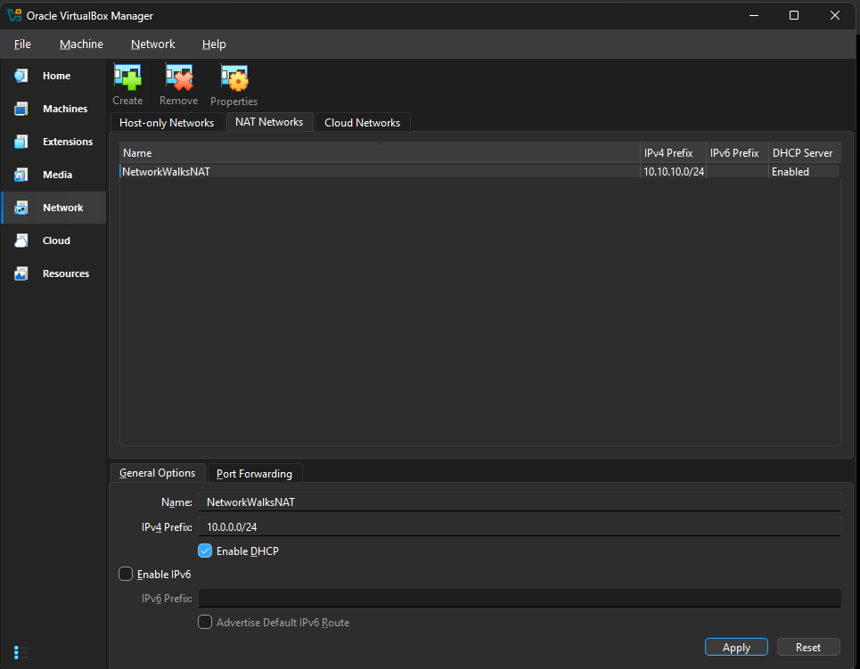
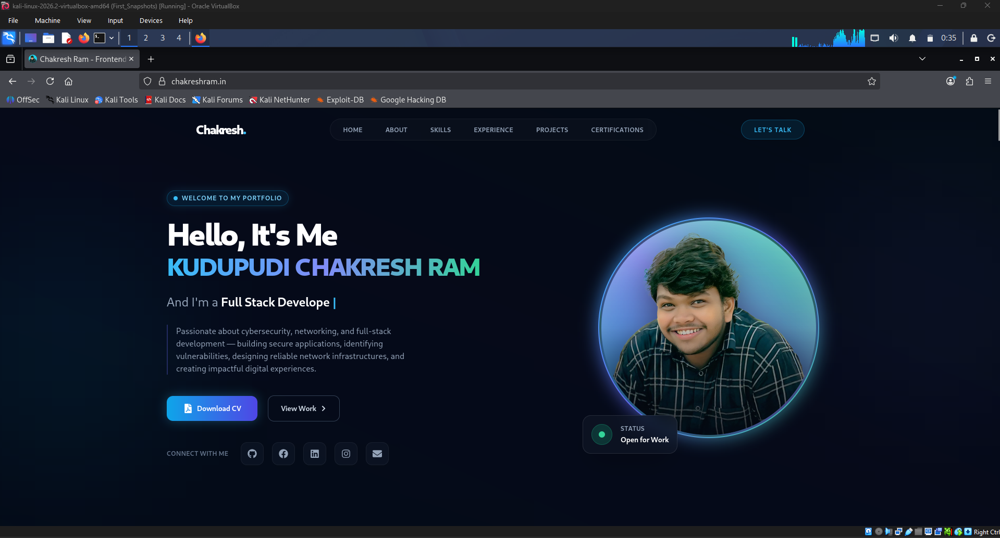

# 🛡️ Networkwalks Cybersecurity Internship


> A hands-on cybersecurity internship portfolio documenting laboratory setup, networking, security tools, practical exercises, technical investigations, and project-based learning at Networkwalks.

---

## 👨‍💻 About This Repository

This repository documents my technical learning journey during my **Cybersecurity Internship at Networkwalks**.

The objective is to build practical cybersecurity skills through controlled laboratory environments, hands-on exercises, security tools, networking activities, troubleshooting, and real-world security scenarios.

The repository will be continuously updated throughout the internship with technical documentation, screenshots, lab configurations, findings, and project reports.

---

## 🎯 Internship Focus Areas

The internship provides practical exposure to:

- 🔐 Network Security
- 🕵️ Vulnerability Assessment
- ⚔️ Penetration Testing
- 🛡️ Security Operations
- 🚨 Incident Response
- 🔎 Digital Forensics
- 📊 Risk Assessment
- 🌐 Network Administration
- 🐧 Linux Security
- 🧪 Security Laboratory Testing
- 📚 Cybersecurity Best Practices

---

# 🧪 Cybersecurity Lab Environment

The initial laboratory environment was built using:

| Component | Configuration |
|---|---|
| Host OS | Windows |
| Virtualization | Oracle VirtualBox |
| Security OS | Kali Linux |
| Network Type | VirtualBox NAT Network |
| NAT Network Name | `NetworkWalksNAT` |
| Network CIDR | `10.10.10.0/24` |
| DHCP | Enabled |
| Linux Network Tools | `ifconfig`, `ip` |
| Lab Recovery | VirtualBox Snapshot |
| File Integration | VirtualBox Shared Folder |

---

## 🌐 Lab Architecture

```text
                         Internet
                            │
                            │
                    ┌───────▼────────┐
                    │ Oracle Virtual │
                    │     Box        │
                    └───────┬────────┘
                            │
                ┌───────────▼───────────┐
                │  NetworkWalksNAT      │
                │   10.10.10.0/24      │
                │   DHCP Enabled       │
                └───────────┬───────────┘
                            │
                    ┌───────▼────────┐
                    │   Kali Linux   │
                    │ Security Lab   │
                    └───────┬────────┘
                            │
                  ┌─────────▼─────────┐
                  │ Security Testing  │
                  │ & Lab Exercises   │
                  └───────────────────┘
```

---

# ⚙️ Environment Setup

The cybersecurity laboratory was prepared in the following stages:

### 1. Created VirtualBox NAT Network

A dedicated NAT Network named:

```text
NetworkWalksNAT
```

was configured with:

```text
10.10.10.0/24
```

DHCP was enabled to allow virtual machines to receive network configuration automatically.

### 2. Connected Kali Linux

The Kali Linux virtual machine was configured to use the newly created NAT Network.

### 3. Created Initial Snapshot

A clean VirtualBox snapshot was created before starting further security laboratory activities.

This provides a recovery point for restoring the lab if a configuration or experiment causes problems.

### 4. Verified IP Configuration

The Kali Linux network interface was checked using Linux networking commands.

Example:

```bash
ifconfig
```

and:

```bash
ip addr
```

### 5. Tested Network Connectivity

Network connectivity from Kali Linux was verified before proceeding with further laboratory exercises.

Example:

```bash
ping -c 4 8.8.8.8
```

### 6. Configured Shared Folder

A VirtualBox shared folder was configured to facilitate controlled file exchange between the host system and Kali Linux laboratory environment.

---

# 📸 Environment Setup Evidence

## 01 — Create NAT Network

A dedicated VirtualBox NAT Network was created for the cybersecurity laboratory.



---

## 02 — Kali Linux Connected to NAT Network

The Kali Linux virtual machine was configured to use the `NetworkWalksNAT` network.


---

## 03 — Initial VirtualBox Snapshot

A baseline snapshot was created before beginning the laboratory exercises.


---

## 04 — Kali Linux IP Address

The Kali Linux network configuration was verified and the assigned IP address was identified.


---

## 05 — Network Connectivity Test

Network connectivity was tested from the Kali Linux environment.



---

## 06 — Shared Folder

A VirtualBox shared folder was configured for controlled file exchange between the host and virtual machine.


---

# 📚 Internship Progress

## Week 01

Focus:

* Cybersecurity fundamentals
* Linux fundamentals
* Networking fundamentals
* Kali Linux
* Laboratory environment setup
* Virtualization
* Network configuration

Documentation:

➡️ [`week-01/`](week-01/)

---

## Week 02

Focus areas will be documented as the internship progresses.

➡️ [`week-02/`](week-02/)

---

## Week 03

Focus areas will be documented as the internship progresses.

➡️ [`week-03/`](week-03/)

---

## Week 04

Final learning activities, projects, and technical documentation will be added here.

➡️ [`week-04/`](week-04/)

---

# 🛠️ Tools & Technologies

Technologies and tools used or explored during the internship include:

* Kali Linux
* Oracle VirtualBox
* Linux CLI
* Nmap
* Wireshark
* Burp Suite
* Metasploit Framework
* Gobuster
* Nikto
* Netcat
* Git
* GitHub
* GNS3
* Zabbix

> Tools will be added to this list as they are actually used during the internship.

---

# 📂 Repository Organization

```text
environment-setup/   → Cybersecurity lab configuration
week-01/             → Week 01 learning and activities
week-02/             → Week 02 learning and activities
week-03/             → Week 03 learning and activities
week-04/             → Week 04 learning and activities
projects/            → Cybersecurity projects
reports/             → Technical reports
docs/                → Learning notes and documentation
```

---

# 🔐 Security & Ethics

All security testing documented in this repository is intended for:

* Authorized laboratory environments
* Educational purposes
* Systems owned by me
* Systems for which explicit permission has been provided

No unauthorized systems, networks, applications, or accounts should be targeted using the techniques documented here.

Responsible disclosure and applicable laws must always be followed.

---

# 📈 Learning Approach

My approach throughout this internship is based on:

```text
Learn
  ↓
Configure
  ↓
Test
  ↓
Troubleshoot
  ↓
Document
  ↓
Analyze
  ↓
Improve
```

The goal is not simply to run security tools, but to understand:

* What the technology does
* Why it works
* How it can fail
* How to identify security issues
* How to interpret results
* How to document technical findings

---

# 🚀 Future Additions

This repository will continue to evolve with:

* Network security laboratories
* Vulnerability assessment exercises
* Penetration testing labs
* Web security testing
* Security monitoring
* Incident response exercises
* Digital forensics investigations
* OSINT exercises
* Security automation
* Technical reports
* Final internship projects

---

# 👤 Author

**Chakresh Ram Kudupudi**

Cybersecurity | Networking | Full-Stack Development

GitHub: [@chakreshram11](https://github.com/chakreshram11)

Portfolio: [chakreshram.in](https://chakreshram.in)

---

## ⚠️ Disclaimer

This repository is maintained for educational and professional portfolio purposes.

Cybersecurity techniques must only be used against systems and environments where proper authorization has been obtained.
