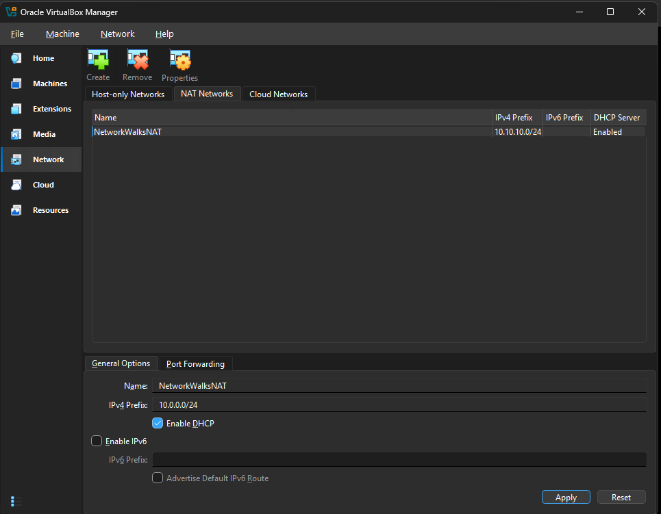
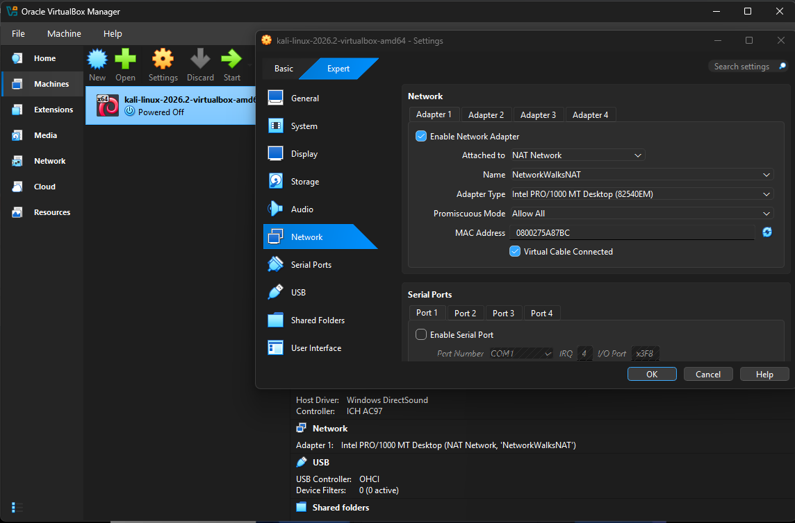
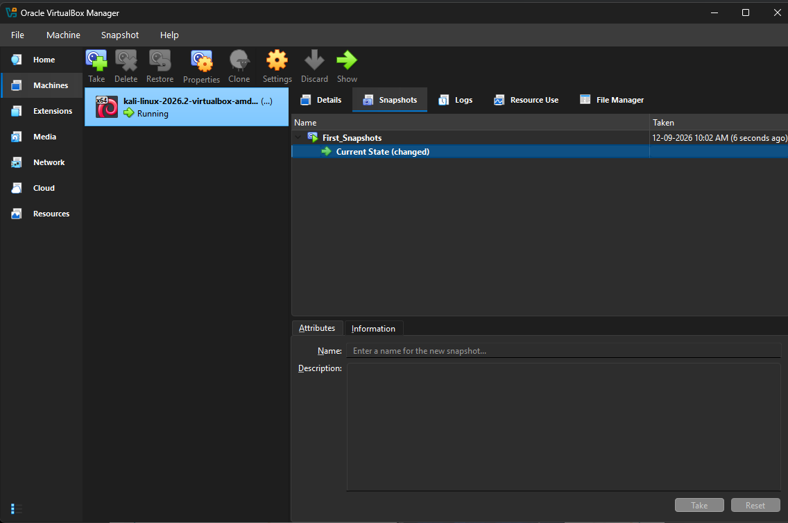
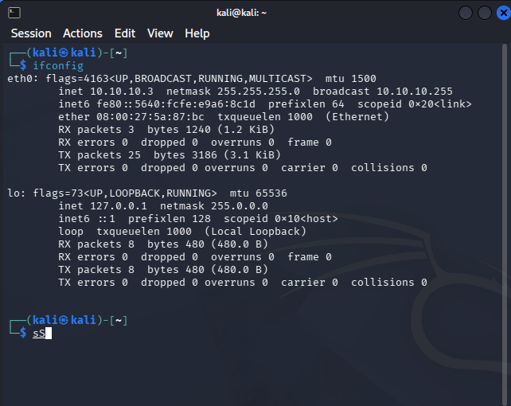
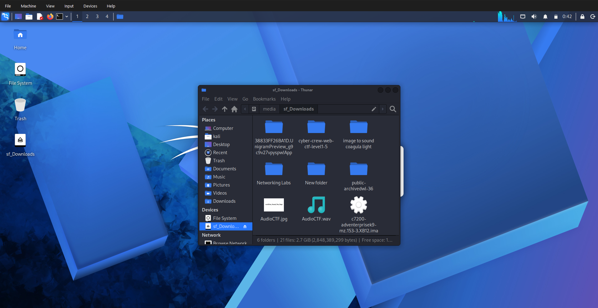

# 🛡️ Networkwalks Cybersecurity Internship


> A hands-on cybersecurity internship portfolio documenting laboratory setup, networking, security tools, practical exercises, technical investigations, and project-based learning at Networkwalks.

---

## 👨‍💻 About This Repository

This repository documents my technical learning journey during my **Cybersecurity Internship at Networkwalks**.

The objective is to build practical cybersecurity skills through controlled laboratory environments, hands-on exercises, security tools, networking activities, troubleshooting, and real-world security scenarios across the 4-week internship program.

---

## 📂 Repository Structure

The internship is organized into weekly modules:

```text
networkwalks-cybersecurity-internship/
│
├── README.md
├── .gitignore
│
├── week-01/       → Cybersecurity Lab Environment Setup & Baseline Configuration
├── week-02/       → Week 02 Learning & Technical Documentation
├── week-03/       → Week 03 Learning & Technical Documentation
└── week-04/       → Week 04 Learning, Projects & Final Internship Summary
```

---

## 🎯 Internship Focus Areas

The internship provides practical exposure to:

- 🔐 Network Security & Administration
- 🕵️ Vulnerability Assessment & Risk Identification
- ⚔️ Penetration Testing Methodologies
- 🛡️ Security Operations & Monitoring
- 🚨 Incident Response & Forensics
- 🐧 Linux Security & Kali Linux Tools
- 🧪 Security Laboratory Design & Virtualization

---

# 🧪 Week 01 — Cybersecurity Lab Environment

The initial laboratory environment was built during **Week 01** using:

| Component | Configuration |
|---|---|
| Host OS | Windows 11 Pro |
| Virtualization | Oracle VirtualBox |
| Security OS | Kali Linux |
| Network Type | VirtualBox NAT Network |
| NAT Network Name | `NetworkWalksNAT` |
| Network CIDR | `10.10.10.0/24` |
| DHCP | Enabled |
| Assigned Kali IP | `10.10.10.3` |
| Lab Recovery | VirtualBox Snapshot (`First_Snapshots`) |
| File Integration | VirtualBox Shared Folder (`sf_Downloads`) |

---

## 🌐 Lab Architecture

```text
                         Internet
                            │
                            │
                    ┌───────▼────────┐
                    │ Oracle Virtual │
                    │     Box        │
                    └───────┬────────┘
                            │
                ┌───────────▼───────────┐
                │  NetworkWalksNAT      │
                │   10.10.10.0/24      │
                │   DHCP Enabled       │
                └───────────┬───────────┘
                            │
                    ┌───────▼────────┐
                    │   Kali Linux   │
                    │ Security Lab   │
                    └───────┬────────┘
                            │
                  ┌─────────▼─────────┐
                  │ Security Testing  │
                  │ & Lab Exercises   │
                  └───────────────────┘
```

---

# ⚙️ Week 01 Setup Evidence

### 1. Created VirtualBox NAT Network
Configured `NetworkWalksNAT` (`10.10.10.0/24`) with DHCP enabled.



---

### 2. Connected Kali Linux VM
Connected Kali Linux virtual machine to the `NetworkWalksNAT` network.



---

### 3. Created Initial Snapshot
Created a baseline snapshot (`First_Snapshots`) for fast recovery.



---

### 4. Verified IP Configuration
Verified dynamic IP allocation (`10.10.10.3`) using `ifconfig`.



---

### 5. Tested Network Connectivity
Tested outbound internet connectivity from Kali Linux.


---

### 6. Configured Shared Folder
Setup VirtualBox Shared Folder (`sf_Downloads`) for host-guest file sharing.



---

# 📚 Internship Progress Summary

## ➡️ [Week 01 Documentation](week-01/)
- Cybersecurity Fundamentals & Virtualization
- Kali Linux Installation & Network Setup
- VirtualBox NAT Network & Snapshot Creation
- Interface IP Verification & Shared Folder Integration

## ➡️ [Week 02 Documentation](week-02/)
- *Documentation will be added as the internship progresses.*

## ➡️ [Week 03 Documentation](week-03/)
- *Documentation will be added as the internship progresses.*

## ➡️ [Week 04 Documentation](week-04/)
- *Documentation will be added as the internship progresses.*

---

# 🔐 Security & Ethics

All security testing documented in this repository is intended for:
- Authorized laboratory environments
- Educational purposes
- Systems owned by me or for which explicit permission has been provided

Responsible disclosure and applicable laws must always be followed.

---

# 👤 Author

**Chakresh Ram Kudupudi**

Cybersecurity | Networking | Full-Stack Development

GitHub: [@chakreshram11](https://github.com/chakreshram11)  
Portfolio: [chakreshram.in](https://chakreshram.in)

---

## ⚠️ Disclaimer

This repository is maintained for educational and professional portfolio purposes.
