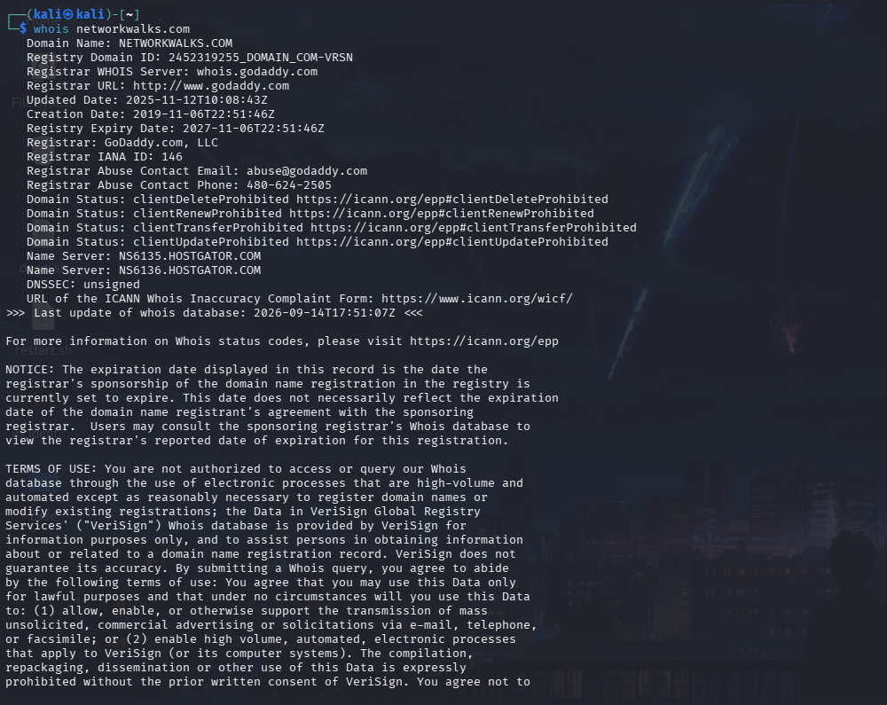
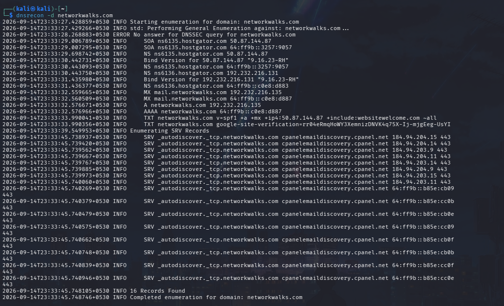
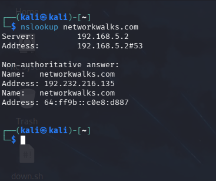
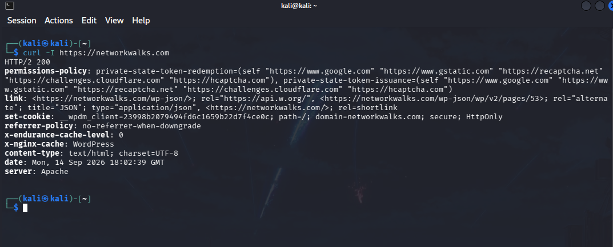
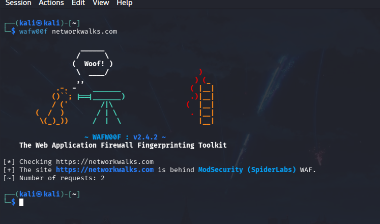
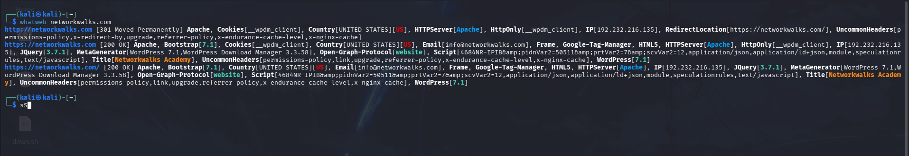
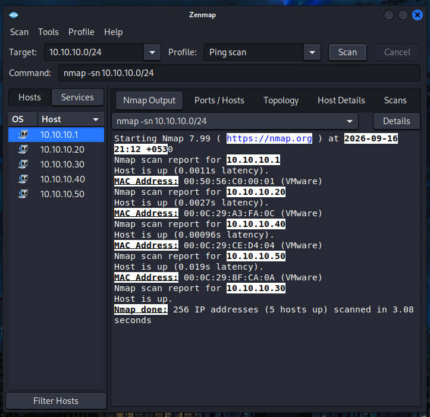

🧪 Week 02 — Footprinting, Reconnaissance & Network Scanning

This directory documents the practical cybersecurity activities completed during Week 02 of the NetworkWalks Cybersecurity Internship.

The week focused on:

Web Footprinting & Reconnaissance using Kali Linux

Internal Network Discovery using Zenmap/Nmap

All activities were performed within the authorized educational lab scope.

🎯 Week 02 Objectives

Collect publicly available information about a target domain.

Enumerate DNS records and infrastructure information.

Identify web technologies and server information.

Inspect HTTP response headers.

Detect the presence of a Web Application Firewall (WAF).

Discover active hosts on an authorized internal lab network.

Document observations in a structured security report.

🧰 Tools Used

Tool

Purpose

Kali Linux

Security testing and reconnaissance environment

WHOIS

Domain registration and name-server information

WhatWeb

Web technology fingerprinting

Nslookup

DNS resolution and IP identification

cURL

HTTP response/header inspection

Wafw00f

WAF detection

DNSRecon

DNS record enumeration

Zenmap / Nmap

Internal host discovery and network scanning

🔄 Week 02 Workflow

                 FOOTPRINTING & RECONNAISSANCE
                              │
                              ▼
                     WHOIS Enumeration
                              │
                              ▼
                  DNSRecon / Nslookup
                              │
                              ▼
                   Web Fingerprinting
                         (WhatWeb)
                              │
                              ▼
                  HTTP Header Analysis
                         (cURL)
                              │
                              ▼
                       WAF Detection
                        (Wafw00f)
                              │
                              ▼
                  INTERNAL NETWORK DISCOVERY
                              │
                              ▼
                   Zenmap / Nmap Ping Scan
                              │
                              ▼
                    Identify Active Hosts

🌐 1. Web Footprinting & Reconnaissance

Target: networkwalks.com

The following Kali Linux tools were used to collect different categories of information about the target domain.

Scope: Reconnaissance activities were performed as part of the authorized NetworkWalks educational exercise. No exploitation was performed during this activity.

01 — WHOIS Enumeration

Command

whois networkwalks.com

Purpose

WHOIS was used to collect publicly available domain registration information including registrar details, dates, name servers, domain status and DNSSEC status.

Observed Information

Registrar: GoDaddy.com, LLC

Name Servers: NS6135.HOSTGATOR.COM

Domain Creation: 2019-11-06

Registry Expiry: 2027-11-06

DNSSEC: Unsigned

Evidence

02 — DNS Enumeration with DNSRecon

Command

dnsrecon -d networkwalks.com

Purpose

DNSRecon was used to enumerate DNS records associated with the domain.

Observed Information

The output included information relating to:

A record

AAAA record

Name servers

MX/mail records

TXT/SPF information

SRV records

cPanel autodiscover services

Observed IPv4 address:

192.232.216.135

Evidence

03 — DNS Resolution with Nslookup

Command

nslookup networkwalks.com

Result

networkwalks.com → 192.232.216.135

Evidence

04 — HTTP Header Inspection with cURL

Command

curl -I https://networkwalks.com

Purpose

The -I option was used to retrieve HTTP response headers.

Observed Information

The response included:

HTTP/2 200

Apache web server information

WordPress-related information

/wp-json/ REST API reference

Other HTTP/application headers

Evidence

05 — WAF Detection with Wafw00f

Command

wafw00f networkwalks.com

Result

The tool identified:

ModSecurity (SpiderLabs)

as the detected Web Application Firewall.

Evidence

06 — Web Technology Fingerprinting with WhatWeb

Command

whatweb networkwalks.com

Purpose

WhatWeb was used to identify technologies and components exposed by the website.

Observed Technologies

The captured output identified technologies including:

Apache

WordPress

Bootstrap

jQuery

WP Download Manager

Google Tag Manager

Other HTTP/application headers

Evidence

🖧 2. Internal Network Discovery with Zenmap

Zenmap was used to perform a Ping Scan against the authorized internal laboratory subnet.

Target Subnet

10.10.10.0/24

Profile

Ping Scan

Command

nmap -sn 10.10.10.0/24

Result

The scan checked:

256 IP addresses

and identified:

5 hosts up

Active Hosts Observed

Host

IP Address

Host 1

10.10.10.1

Host 2

10.10.10.20

Host 3

10.10.10.30

Host 4

10.10.10.40

Host 5

10.10.10.50

Zenmap also displayed MAC-address information for the discovered hosts.

Evidence

📊 3. Key Observations

#

Observation

Security Relevance

1

Web technology information was identifiable

May assist further authorized security assessment.

2

Public DNS information was available

Can help build an infrastructure profile.

3

Server IP address was resolvable

Provides information about the web-service location.

4

HTTP headers exposed technical information

Can assist application fingerprinting and enumeration.

5

ModSecurity WAF was detected

Indicates the presence of an application-layer security control.

6

Multiple internal hosts responded

Helps establish an inventory of active systems in the lab.

Important: These are reconnaissance observations, not confirmed vulnerabilities. Further authorized validation would be required before classifying any observation as a vulnerability.

🛡️ 4. Security Recommendations

Review publicly exposed technology information
Minimize unnecessary disclosure of software and infrastructure details where practical.

Keep web components updated
Regularly update WordPress, plugins and supporting components.

Review HTTP response headers
Remove unnecessary technical information where appropriate.

Review DNS records regularly
Remove obsolete or unnecessary records and services.

Maintain WAF configuration
Keep the WAF properly configured, monitored and updated.

Maintain an internal asset inventory
Regularly identify and document active devices within authorized networks.

Investigate unknown hosts
Unexpected systems discovered during scanning should be identified and verified.

Perform testing only within authorized scope
Reconnaissance and scanning should only be conducted where appropriate authorization exists.

🧠 5. Key Learning Outcomes

Through this practical exercise, I learned how to:

Perform domain footprinting using WHOIS.

Enumerate DNS information using DNSRecon.

Resolve domains using Nslookup.

Inspect HTTP response headers with cURL.

Fingerprint web technologies using WhatWeb.

Detect WAF technologies using Wafw00f.

Discover active hosts using Zenmap/Nmap.

Document technical observations in a structured security report.

Distinguish reconnaissance observations from confirmed vulnerabilities.

📁 6. Repository Contents

week-02/
│
├── README.md
├── NetworkWalks_Week2_Footprinting_Report.docx
├── command output.txt
│
├── whois.png
├── curl.png
├── dnsrecon.png
├── nslookup.png
├── wafwoof.png
├── whatweb.png
└── zenmap mac address.png

📄 7. Detailed Report

The complete report containing methodology, observations, risk analysis, recommendations and evidence is available in:

NetworkWalks_Week2_Footprinting_Report.docx

🏁 Week 02 Outcome

Week 02 provided practical experience in web footprinting, DNS enumeration, technology fingerprinting, HTTP analysis, WAF detection and internal network discovery.

The exercises demonstrated how reconnaissance can reveal useful information about web infrastructure and internal lab environments before deeper security testing is performed.

👤 Author

Chakresh Ram Kudupudi

Cybersecurity Graduate
NetworkWalks Cybersecurity Internship

⚠️ Ethical Use Notice: All techniques documented in this repository are intended for authorized security testing, cybersecurity education and systems owned or explicitly permitted for testing. Unauthorized scanning or access may violate organizational policies and applicable laws.